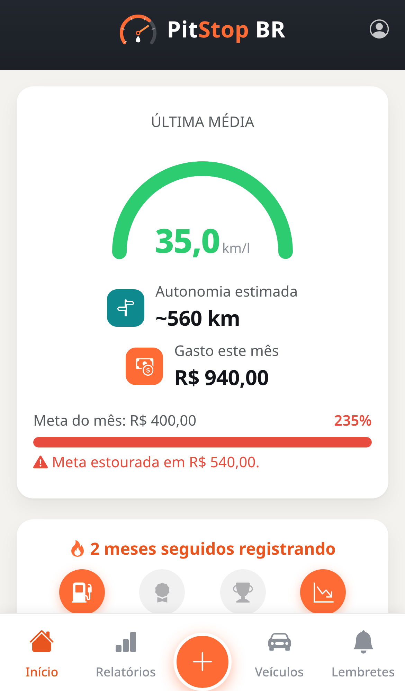
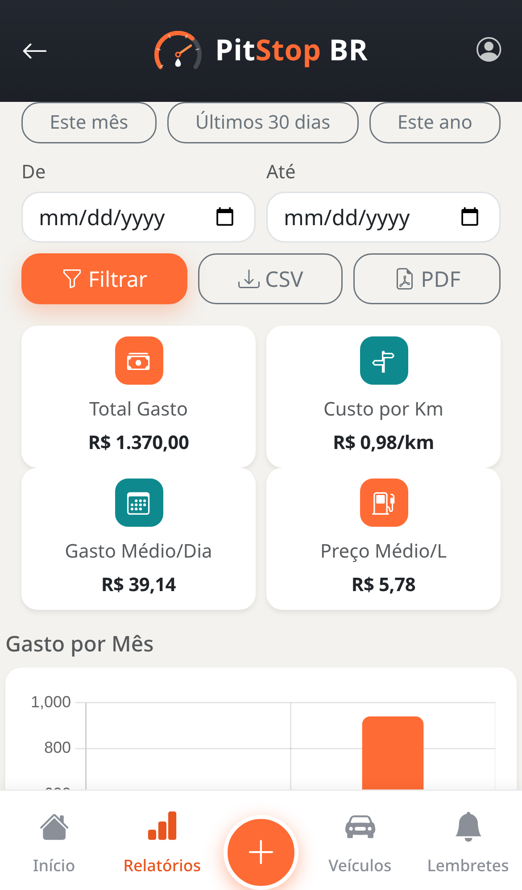
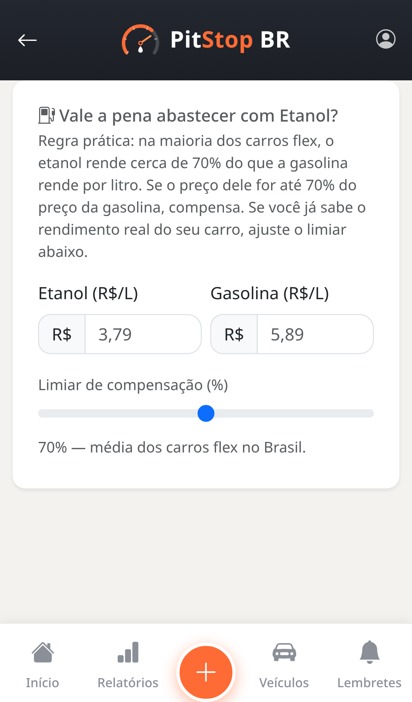
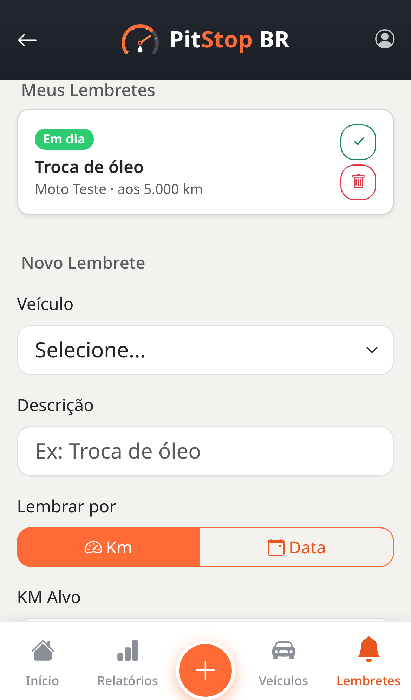
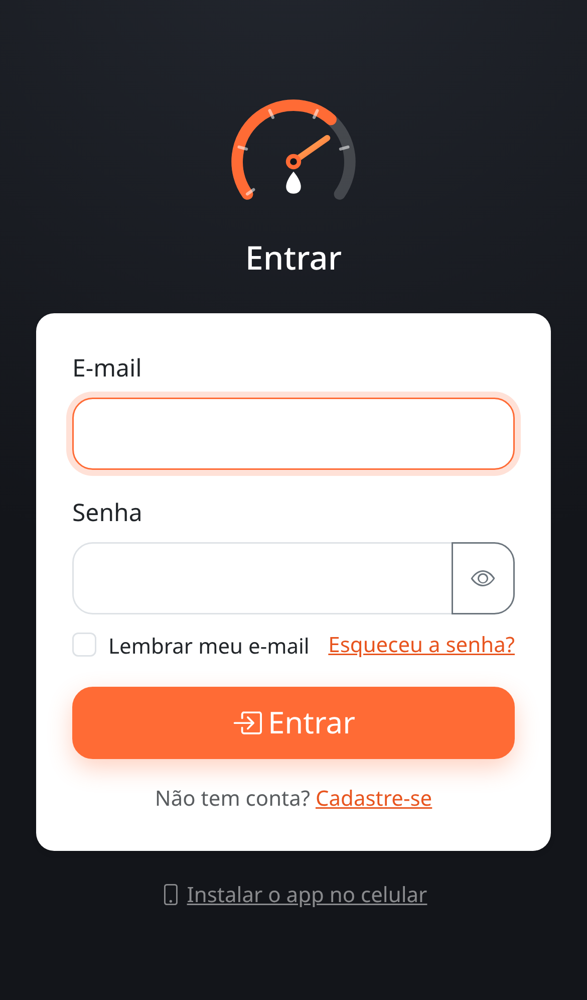

# PitStop BR

[](https://www.php.net/)
[](https://www.mysql.com/)
[](https://www.docker.com/)
[](LICENSE)

Sistema web simples, focado em mobile, para registrar abastecimentos e manutenções de veículos e
acompanhar consumo (km/l) e gastos. Acesse em **https://pitstop.morenadoaco.com.br**.

<p align="center">
  
  
  
  
  
</p>

## Funcionalidades

- Multi-usuário: cada conta só enxerga e mexe nos próprios veículos/registros
- Cadastro aberto com confirmação de e-mail (código de 6 dígitos, válido por 15 min, com limite de
  tentativas e reenvio), rate limit de 5 cadastros por hora por IP; também dá pra entrar por
  convite de quem já usa o app (link com token de uso único e validade de 7 dias, e-mail
  considerado confirmado automaticamente nesse caso)
- Painel Administrativo (conta com papel "admin"): visão agregada de todas as contas — veículos,
  registros e total gasto por conta — sem acessar o detalhe de nenhum registro individual
- Funciona sem internet: Service Worker + fila offline (IndexedDB) guardam o que você registra sem
  sinal e sincronizam sozinhos assim que a conexão volta (inclusive em segundo plano, via
  Background Sync); aviso de "o que mudou" nas primeiras aberturas depois de uma atualização
- Login com bloqueio temporário após tentativas falhas, opção de lembrar o e-mail no aparelho (sem
  guardar senha) e botão de mostrar/ocultar senha nos campos de senha
- Recuperação de senha esquecida por link de e-mail (token único de uso único, válido por 1h, sem
  revelar se o e-mail existe na base)
- Cadastro, edição e exclusão de veículos (nome, tipo, cor, placa) com busca inteligente de modelo
  (ex.: "Bros 160 2025") que autopreenche capacidade do tanque e peso a partir de um catálogo de
  modelos comuns no Brasil — campos continuam editáveis à mão se o modelo não estiver no catálogo
- Registro, edição e exclusão de abastecimentos (km, litros, valor pago, combustível: Gasolina
  Comum/Aditivada, Etanol, Diesel, GNV ou Outro), manutenções (km, valor, descrição) e despesas
  (Seguro, IPVA, Estacionamento, Pedágio, Multa, Lavagem ou Outro)
- Lembretes de manutenção/documentos por km ou por data (ex.: troca de óleo aos 40.000km, seguro
  vencendo em uma data), com status Vencido/Próximo/Em dia, alerta no painel principal e
  **notificação push** (Minha Conta → Notificações) avisando mesmo com o app fechado
- Conquistas (gamificação): sequência de meses seguidos registrando, e selos por marco —
  Primeira Carga, 10 Abastecimentos, Motorista Veterano (50), Economia do Mês (consumo médio
  melhor que o mês anterior) e Manutenção em Dia — calculados na hora a partir dos próprios dados,
  exibidos no painel principal
- Cálculo automático da última média de consumo (km/l), do preço por litro, do gasto do mês e da
  autonomia estimada do tanque cheio (capacidade do tanque × última média)
- Meta de gasto mensal configurável (Minha Conta), com barra de progresso colorida no painel
  principal comparando o gasto do mês com a meta (verde/amarelo/vermelho) e projeção de gasto até
  o fim do mês no ritmo atual
- Calculadora Etanol × Gasolina (regra dos 70%, com limiar ajustável) pra saber na hora qual
  combustível compensa mais
- Relatórios com gráficos (Chart.js): gasto por mês, km rodado por mês, evolução do consumo e
  distribuição do gasto por categoria (combustível, manutenção, cada tipo de despesa), cards de
  gasto total, custo por km, gasto médio por dia e preço médio por litro, atalhos de período (este
  mês, últimos 30 dias, este ano) além do filtro manual por veículo e por data, exportação em CSV
  ou PDF (impressão do navegador), comparação do consumo real com o de fábrica (cidade/estrada)
  quando o veículo tem modelo do catálogo vinculado, e tabela comparando consumo/custo por
  km/gasto entre todos os veículos de quem tem 2 ou mais cadastrados
- Filtro de registros e relatórios por veículo
- Conformidade com a LGPD: política de privacidade, aceite de consentimento obrigatório no
  cadastro/convite e exclusão definitiva da própria conta e dados (direito ao esquecimento)
- Identidade visual própria (paleta laranja + teal, logo, favicons), com medidor (gauge) de
  consumo, selos de ícone coloridos nas estatísticas, transições e micro-interações em toda a
  interface, e manifest PWA (instalável na tela inicial)
- App Android nativo (TWA assinado) pra instalar via APK, além do PWA — página `/instalar.php`
  com instruções pras duas formas
- Interface mobile-only por design (Bootstrap 5 + Bootstrap Icons) com navegação inferior fixa e
  botão de novo registro embutido na própria barra (elevado, ao centro) — mesmo layout em qualquer
  tamanho de tela, só centralizado numa largura de celular a partir de 560px (sem layout separado
  de desktop/notebook)
- Estados vazios com ícone, texto e chamada para ação em vez de mensagens soltas

## Stack

- **Frontend:** HTML5 + Bootstrap 5 (CDN) + Bootstrap Icons + Chart.js (CDN) + identidade visual própria (CSS, com animações) + manifest PWA + Service Worker/IndexedDB (modo offline)
- **Backend:** PHP 8.2 puro (sem framework), Apache
- **Banco:** MySQL 8.0, acesso exclusivo via PDO (prepared statements)
- **E-mail:** cliente SMTP próprio em PHP puro (sem dependências), usado pro envio de convites
- **Notificações push:** [minishlink/web-push](https://github.com/web-push-libs/web-push-php) (única dependência via Composer do projeto — VAPID + criptografia do payload são delicados demais pra reinventar na mão) rodando num serviço `cron` dedicado
- **App Android:** TWA (Trusted Web Activity) gerado com Bubblewrap, assinado com keystore próprio
- **Infra:** Docker Compose (build próprio da imagem PHP+Apache hardenizada)

## Estrutura de pastas

```
pitstop-br/
├── docker-compose.yml
├── .env                    # credenciais (gitignored, gerado localmente)
├── db/
│   └── init.sql            # schema + seed inicial
├── docker/php/
│   ├── Dockerfile          # imagem PHP+Apache hardenizada
│   ├── php.ini             # hardening PHP (expose_php off, sessão segura, sem upload...)
│   └── security.conf       # hardening Apache (headers, sem listagem de diretório)
└── src/
    ├── api/
    │   ├── registro.php    # POST idempotente (client_uuid) usado pela fila offline
    │   ├── lembrete.php    # POST idempotente (client_uuid) usado pela fila offline
    │   └── versao.php      # versão + changelog em JSON (aviso de atualização)
    ├── assets/
    │   ├── css/brand.css   # identidade visual (paleta, header, bottom-nav, telas de auth)
    │   ├── img/            # logo, favicons e ícones PWA
    │   └── js/
    │       ├── offline.js       # registra o SW, intercepta formulários sem sinal, aviso de atualização
    │       └── idb-outbox.js    # fila offline (IndexedDB), compartilhada com o Service Worker
    ├── config/
    │   ├── bootstrap.php   # sessão segura (30 dias, PWA) + carrega conexão/CSRF/auth/funções/versão
    │   ├── conexao.php     # PDO (lê credenciais do ambiente)
    │   ├── csrf.php        # geração/validação de token CSRF
    │   ├── auth.php        # login/registro/logout/guard, papel admin, verificação de e-mail, lockout
    │   ├── versao.php      # versão do app + changelog (rodapé e aviso de atualização)
    │   └── mailer.php      # cliente SMTP mínimo (sem dependências) pro envio de convites/códigos
    ├── includes/
    │   ├── functions.php   # helpers (escape, flash, cálculo de consumo, validação de registro/lembrete)
    │   ├── header.php
    │   └── footer.php
    ├── manifest.json       # manifest PWA (instalável na tela inicial)
    ├── sw.php              # Service Worker (cache com versionamento, fallback offline, Background Sync)
    ├── login.php / cadastro.php / verificar_email.php / logout.php   # autenticação + confirmação de e-mail
    ├── esqueci_senha.php / redefinir_senha.php # recuperação de senha por link de e-mail (token único, 1h)
    ├── convidar.php / convite.php              # envio e aceite de convite (registro por convite)
    ├── gerenciador.php     # painel administrativo (dados agregados por conta; só para papel admin)
    ├── conta.php / privacidade.php             # minha conta (exclusão de dados) e política LGPD
    ├── combustivel.php     # calculadora Etanol x Gasolina (regra dos 70%)
    ├── index.php           # dashboard (última média, gastos do mês + projeção, alerta de lembretes, registros)
    ├── relatorios.php      # gráficos de gasto/km/consumo/categorias, custo por km, comparação entre
    │                       # veículos, atalhos de período; filtro por período; export CSV/PDF
    ├── adicionar.php / registro_editar.php / excluir.php   # CRUD de registros (abastecimento/manutenção/despesa)
    ├── lembretes.php / lembrete_concluir.php / lembrete_excluir.php   # lembretes de manutenção (km ou data)
    └── veiculos.php / veiculo_editar.php / veiculo_excluir.php   # CRUD de veículos
```

## Segurança aplicada

- 100% PDO com prepared statements (sem SQL cru/concatenado) — zero SQLi
- Proteção CSRF (token por sessão, `hash_equals`) em todo formulário POST
- Output sempre escapado (`htmlspecialchars`) — zero XSS refletido
- Validação estrita (whitelist) de tipo de registro, tipo de veículo, datas e números
- Autenticação: senha com `password_hash`/`password_verify`, bloqueio de 15 min após 5 tentativas
  falhas, mensagem de erro genérica no login (sem enumeração de e-mail), `session_regenerate_id`
  após login/cadastro
- Isolamento multi-usuário: toda consulta/gravação de veículo e registro é restrita por
  `usuario_id` (via FK + `JOIN`/`WHERE`), prevenindo IDOR entre contas
- Confirmação de e-mail: código de 6 dígitos, armazenado só como hash SHA-256 (nunca em texto
  plano), validade de 15 min, limite de tentativas e rate limit de reenvio; sem essa confirmação
  a conta não consegue logar
- Rate limit de cadastro (5 por hora por IP, hash do IP no banco) contra automação de contas em massa
- Papel admin: página administrativa responde 404 (não 403) pra quem não é admin, evitando revelar
  que a rota existe; painel mostra só dados agregados por conta, nunca o detalhe de um registro
- API offline (`api/registro.php`, `api/lembrete.php`) reusa a mesma validação e o mesmo escopo por
  `usuario_id` dos formulários clássicos; inserções são idempotentes por `client_uuid` (`UNIQUE`),
  então reenviar o mesmo item da fila offline nunca duplica dados
- Convites: token de 32 bytes aleatórios, armazenado só como hash SHA-256 no banco (nunca em
  texto plano), expira em 7 dias, uso único garantido por lock transacional (`SELECT ... FOR
  UPDATE`)
- Exclusão de conta exige reautenticação por senha antes de apagar os dados definitivamente
- Sessão: cookie `HttpOnly`, `SameSite=Strict`, `Secure` (atrás de proxy HTTPS)
- Apache: `ServerTokens Prod`, sem listagem de diretório, headers `CSP`/`X-Frame-Options`/
  `X-Content-Type-Options`/`Referrer-Policy`, bloqueio de arquivos sensíveis (`.env`, `.sql`, etc.)
- PHP: `expose_php=Off`, `display_errors=Off`, uploads desabilitados, limites de memória/execução
- Container do app: `read_only` filesystem, `cap_drop: ALL` (com apenas as 3 capabilities
  mínimas necessárias), `no-new-privileges`, sem privilégio de root persistente
- MySQL **sem porta exposta ao host** — acessível apenas pela rede Docker interna
- Senhas geradas aleatoriamente (`openssl rand`), armazenadas só em `.env` (gitignored, `chmod 600`)
- Limites de CPU/memória por container (`deploy.resources.limits`)

## Configuração de e-mail (convites)

Pra enviar convites por e-mail, defina no `.env` (raiz do projeto, gitignored):

```
SMTP_HOST=smtp.exemplo.com
SMTP_PORT=465
SMTP_SECURE=true
SMTP_USER=noreply@pitstop.morenadoaco.com.br
SMTP_PASS=...
SMTP_FROM=PitStop BR <noreply@pitstop.morenadoaco.com.br>
```

Sem essas variáveis, o convite continua sendo gerado no banco normalmente, mas o e-mail não é
enviado (fica registrado em log). O cliente SMTP é caseiro (sem dependências externas), suporta
TLS implícito (porta 465) ou STARTTLS (porta 587) com `AUTH LOGIN`.

## Configuração de notificações push (VAPID)

Pra ativar a notificação push dos lembretes, gere um par de chaves VAPID (uma vez só, por
ambiente) e defina no `.env`:

```bash
docker run --rm -v "$(pwd)/src:/app" -w /app composer:2 exec vendor/bin/web-push-vapid-gen
```

```
VAPID_PUBLIC_KEY=...
VAPID_PRIVATE_KEY=...
VAPID_SUBJECT=mailto:contato@seudominio.com.br
```

Sem essas variáveis, o botão "Ativar notificações" some de Minha Conta e o serviço `cron` só fica
registrando os lembretes vencidos sem enviar nada (nenhum erro, só não notifica).

## URL fixa pros links de e-mail (APP_URL)

Convite e redefinição de senha mandam um link absoluto por e-mail. Defina no `.env`:

```
APP_URL=https://pitstop.morenadoaco.com.br
```

Sem essa variável, o link é montado a partir do `Host` da requisição (fallback só pra
desenvolvimento local) — em produção, `APP_URL` fixa evita que um `Host` forjado no request
troque o domínio do link mandado pro usuário (host header poisoning).

## Como rodar

```bash
cd pitstop-br
scripts/composer-install.sh   # instala src/vendor/ (dependências PHP) via Docker — só na 1ª vez ou quando composer.json mudar
docker compose up -d --build
```

App disponível em `http://127.0.0.1:8033` (atrás de proxy reverso Nginx + TLS em produção).

## Release e versionamento

A versão exibida no app (rodapé, aviso de atualização) e o changelog em linguagem simples vivem em
`src/config/versao.php` (`APP_VERSION`/`APP_CHANGELOG`). Ao dar bump nessa versão e mergear em
`main`, o workflow `.github/workflows/release.yml` cria sozinho a tag e a Release
correspondente no GitHub (`vX.Y.Z`), usando o próprio texto de `APP_CHANGELOG` como notas — sem
passo manual e sem duplicar o changelog em outro lugar. Isso, por sua vez, dispara o
`docker-publish.yml` já existente, que builda e publica a imagem no GHCR com a tag semver da
release. Basta então atualizar a tabela abaixo (histórico técnico, mais detalhado que o do app) no
mesmo commit.

## Histórico de Versões

| Versão | Data       | Descrição                                                                 |
|--------|------------|-----------------------------------------------------------------------------|
| 1.14.0 | 2026-07-06 | **Alertas inteligentes**: nova tabela `alertas` detecta, a partir do histórico de `registros`, três anomalias por abastecimento — consumo 20%+ pior que a média do veículo, preço/L 15%+ acima da média e odômetro menor/igual ao último já registrado (esse último vale pra qualquer tipo de registro, não só abastecimento). Detecção em `detectarAnomaliasRegistro()` (`functions.php`), chamada logo após `inserirRegistro()` em `adicionar.php` e `api/registro.php` — `inserirRegistro()` passou a retornar `['id','novo']` pra fila offline não reprocessar (e duplicar alerta) num replay idempotente do mesmo `client_uuid`. Painel principal ganha bloco de alertas não lidos (dispensável, `api/alerta_lido.php`) e novo cron `enviar_alertas_push.php` (mesmo padrão de dedupe de lembretes, via `push_notificado_em`). **Segurança**: cadastro com e-mail já existente agora responde de forma indistinguível de um cadastro novo (mesmo HTTP 200, mesma tela, mesmo `password_hash()` "inútil" pra igualar o tempo) — e-mail avisa o dono de verdade, sem código nem login automático; `APP_URL` fixa via env substitui `Host` da requisição nos links de convite/redefinição de senha (fecha host header poisoning); sessão ganha timeout de inatividade de 7 dias além do cookie de 30 (`bootstrap.php`); CSP ganha `report-uri` (endpoint novo `api/csp_report.php`, sem auth/CSRF — é o navegador quem chama) e HSTS ganha `preload`. Also reconciliado o drift entre `db/init.sql` e o schema real em produção (`usuarios.role`/`email_verificado_em`, `registros`/`lembretes.client_uuid`, tabelas `verificacoes_email`/`cadastro_rate_limit` — usadas pelo código, aplicadas em produção por fora deste arquivo, mas ausentes dele; sem isso uma instalação nova quebrava no primeiro cadastro/login). Testado ponta a ponta num stack Docker isolado (projeto/porta/volume próprios, produção nunca tocada): instalação do zero validando o `init.sql` corrigido; as 3 anomalias disparando via formulário real (consumo caindo de 30 para 15 km/l, preço 60% acima da média, odômetro voltando); bloco no painel e "marcar como lido" (incluindo CSRF ausente e alerta de outro dono); replay de 3 requisições com o mesmo `client_uuid` via `api/registro.php` confirmando 1 registro + 1 alerta só (não 3); cron rodando duas vezes seguidas confirmando dedupe do push; cadastro com e-mail novo vs. e-mail já existente comparados (mesmo HTTP 200, mesmo corpo, tempo equivalente); e descoberta + correção de um bug real nesse mesmo processo (o caminho de sucesso original fazia redirect 302 enquanto o de e-mail existente respondia 200 — diferença mais óbvia que timing, corrigida antes de fechar a versão) |
| 1.13.0 | 2026-07-05 | Notificações push (Web Push) dos lembretes: `push_inscrever.php`/`push_desinscrever.php` guardam a inscrição do navegador (`push_inscricoes`, deduplicada por hash do endpoint); `sw.php` ganha os handlers `push`/`notificationclick`; novo serviço `cron` (mesma imagem do `web`, sem HTTP) roda `cron/enviar_lembretes_push.php` de hora em hora, manda um push por lembrete vencido/próximo (uma vez só por lembrete, via `lembretes.push_notificado_em`) e some sozinho com inscrições expiradas que o push service reportar. Primeira dependência via Composer do projeto (`minishlink/web-push`, MIT) — VAPID + criptografia do payload são coisa demais pra reinventar na mão; `src/vendor/` fica de fora do Git (`scripts/composer-install.sh` gera via Docker, sem exigir Composer no host). Toggle em Minha Conta só aparece com VAPID configurado. Testado ponta a ponta: geração de chaves VAPID na imagem da própria app, biblioteca carregando via autoload, e a função de envio/limpeza de inscrição expirada revisada linha a linha (sem servidor de push real disponível no ambiente de teste pra disparar uma notificação de verdade) |
| 1.12.0 | 2026-07-05 | Conquistas (gamificação) no painel principal: sequência de meses seguidos com registro, e 5 selos por marco (Primeira Carga, 10 Abastecimentos, Motorista Veterano, Economia do Mês, Manutenção em Dia), com progresso pro próximo selo. Tudo calculado na hora (`calcularConquistas()` em `functions.php`) a partir de `registros`/`lembretes` que já existiam — sem tabela nova, sem estado próprio pra desatualizar. Testado com dados sintéticos num MySQL isolado e descartável (sequência normal, sequência quebrada por mês sem registro, lembrete vencido derrubando o selo "Em Dia") — nenhum dado real de usuário foi lido ou alterado |
| 1.11.0 | 2026-07-05 | Autonomia estimada do tanque no painel principal: `tanque_litros` do veículo (já existia no cadastro, nunca usado em cálculo nenhum) multiplicado pela última média de consumo (`calcularUltimaMedia()`). Só exibido quando o veículo em contexto é inequívoco (filtro de veículo ativo, ou usuário com um único veículo cadastrado) e há tanto tanque quanto consumo calculável. Testado em produção com dados temporários (tanque + segundo abastecimento no mesmo veículo), removidos ao final |
| 1.10.1 | 2026-07-05 | Auditoria de segurança completa (leitura de todo o código-fonte): (1) **CSV Injection** — nome de veículo/descrição iam crus no CSV exportado em Relatórios; nova `sanitizarCelulaCsv()` em `functions.php` prefixa com aspas simples qualquer célula que comece com `= + - @ tab CR`, neutralizando fórmula/DDE no Excel/LibreOffice; (2) **credential stuffing** — bloqueio existente (`tentativas_falhas`) protegia só uma conta por vez; nova tabela `login_rate_limit` (mesmo padrão de `cadastro_rate_limit`) limita a 30 tentativas falhas/hora por IP em `login.php`; (3) **vazamento de e-mail por timing** — em `esqueci_senha.php`, o caminho "conta existe" (gera token + SMTP real) demorava visivelmente mais que "não existe" (só um SELECT), driblando a mensagem genérica; atraso artificial de 300–700ms equaliza os dois; (4) **supply-chain** — Bootstrap/Bootstrap Icons/Chart.js carregados do jsDelivr sem verificação; adicionado SRI (hash sha384 calculado do conteúdo real, verificado sem quebrar nada) + `crossorigin="anonymous"`; (5) **HSTS ausente** — `docker/php/security.conf` ganha `Strict-Transport-Security`, fechando a janela de downgrade na primeira visita antes do redirect do nginx (exigiu rebuild da imagem, `security.conf` não é bind-mount). IDOR, CSRF, SQLi (queries sempre parametrizadas, `EMULATE_PREPARES` off), sessão (regenerate_id, cookies `Secure/HttpOnly/SameSite=Strict`), hardening de Docker (`read_only`, `cap_drop: ALL`, DB sem porta exposta) e `.env`/segredos revisados — nenhum problema encontrado nessas frentes |
| 1.10.0 | 2026-07-05 | Quatro melhorias práticas sem tocar no schema: `combustivel.php` (nova página, calculadora Etanol × Gasolina com limiar ajustável, link no dropdown da conta e atalho no dashboard); `relatorios.php` ganha o card "Custo por Km" (grade 2×2 de stats) e o gráfico rosca "Para Onde Vai o Dinheiro" (nova query agrupando por categoria calculada — combustível/manutenção/categoria de despesa); nova função `calcularEstatisticasVeiculo()` em `functions.php` alimenta uma tabela de comparação entre veículos (consumo médio, custo/km, gasto no período) exibida só com 2+ veículos cadastrados; dashboard mostra projeção de gasto do mês (mantendo o ritmo diário atual) comparada com a meta, e Relatórios ganham atalhos "Este mês/Últimos 30 dias/Este ano" que preenchem as datas e enviam o filtro via JS. `combustivel.php` e seu JS entram em `PAGINAS_AUTENTICADAS`/`PRECACHE_URLS` do Service Worker. Testado com Playwright em produção: calculadora nos dois vereditos, gráfico de categorias renderizando, atalhos de período filtrando, ausência de erros de console |
| 1.9.0  | 2026-07-05 | Recuperação de senha: `esqueci_senha.php` (rate limit de 5/hora por IP, tabela `redefinicao_rate_limit`, sempre responde com a mesma mensagem genérica pra não revelar se o e-mail existe) gera um token de uso único (tabela `redefinicoes_senha`, só o hash é guardado, válido por 1h) e manda por e-mail um link pra `redefinir_senha.php`, que troca a senha (com lock via transação, igual ao aceite de convite) e zera bloqueio/tentativas falhas da conta. Tela de login ganhou checkbox "Lembrar meu e-mail" (guardado só no `localStorage` do aparelho, nunca a senha) e botão de olho pra mostrar/ocultar senha (`assets/js/auth.js`), replicado no cadastro e na redefinição. Testado com Playwright: geração do token em produção, página de link inválido/expirado, toggle de senha e ausência de erros de console |
| 1.8.0  | 2026-07-05 | Meta de gasto mensal: nova coluna `usuarios.meta_mensal`, formulário em `conta.php` (ação `salvar_meta`, aceita vírgula ou ponto decimal, vazio remove a meta) e barra de progresso colorida no card de resumo do dashboard (`index.php`) comparando gasto do mês vs. meta — verde até 70%, amarelo até estourar, vermelho acima de 100%, com texto de quanto falta ou quanto passou. Corrigido também bug visual em `instalar.php`: a fingerprint SHA-256 do APK estourava a largura da tela em telas estreitas (sem quebra de linha) — nova classe `.fingerprint-apk` (`word-break: break-all`) e `overflow-x: hidden` no `body` como rede de segurança. Testado com Playwright: login real, ajuste da meta nos três estados (ok/atenção/estourada) e remoção, e `scrollWidth`/`clientWidth` de `instalar.php` confirmando ausência de overflow |
| 1.7.0  | 2026-07-01 | Cadastro inteligente de veículo: novos campos cor/placa, e busca de modelo (`api/buscar_modelo.php`, separa texto de ano automaticamente — ex. "Bros 160 2025") que autopreenche tanque/peso a partir de um novo catálogo (`modelos_veiculos`, ~20 modelos comuns no Brasil). Relatórios ganham card de comparação do consumo real com o de fábrica (cidade/estrada) quando o veículo tem modelo vinculado. Testado com Playwright: busca retornando o modelo certo, autopreenchimento, salvamento no banco e card de comparação renderizando com os números certos |
| 1.6.9  | 2026-07-01 | Removido o layout separado de desktop/notebook (sidebar, colunas largas) — o app é mobile-only de propósito agora, mesma disposição em qualquer tamanho de tela, só centralizada numa largura de celular a partir de 560px. `assets/js/viewport.js` removido (órfão, só existia pra decidir esse layout) |
| 1.6.8  | 2026-07-01 | Duas correções: (1) offline logo após instalar o app do zero — o cache de páginas autenticadas só era preenchido no `install` (que roda antes do primeiro login) ou visitando cada tela manualmente; agora `offline.js` avisa o Service Worker via `postMessage` assim que confirma sessão ativa, recarregando o cache sem precisar navegar por tudo primeiro; (2) espaço vazio grande sobrando embaixo da tela em páginas com pouco conteúdo (ex.: nenhum registro ainda) — `body`/`.app-shell`/`main.container` viram uma coluna flex de altura real (`100dvh`), e o bloco de lista cresce pra preencher o espaço, centralizando só o estado vazio (listas com dados continuam alinhadas no topo). Ambas testadas com Playwright (instalação do zero + bloqueio de rede real, e inspeção do layout renderizado) |
| 1.6.7  | 2026-07-01 | Duas correções sérias do modo offline: (1) o `install` do Service Worker agora busca cada página autenticada com a sessão atual e só cacheia se vier direto (sem redirect pra login) — antes, cada atualização de versão apagava o cache antigo e deixava tudo vazio até o usuário visitar cada página manualmente; (2) `offline.js` não confia mais só em `navigator.onLine` (que reporta "online" mesmo com wifi/dados sem internet de verdade) — testa uma busca real (`HEAD /manifest.json`, 2.5s) antes de deixar o formulário submeter nativamente, evitando o app travar no aviso de "confirmar reenvio do formulário" do navegador. Fallback final do SW também trocado por uma resposta com a marca do app em vez da tela genérica do navegador. Testado com Playwright com bloqueio de rede real (`route.abort`) |
| 1.6.6  | 2026-07-01 | Correção de texto/elementos renderizando maiores dentro do app instalado (TWA) do que numa aba comum do navegador: faltava `text-size-adjust: 100%` no CSS, e sem isso o WebView do Android aplica sozinho um recurso de "aumentar a fonte pra ficar legível" (pensado pra sites antigos não responsivos) — trava em 100% pra sempre respeitar o tamanho definido no CSS |
| 1.6.5  | 2026-07-01 | Correção definitiva do layout "de PC" no celular (sidebar/colunas largas): a tentativa anterior (1.6.2) travava por `@media (pointer: fine)`, mas essa media feature dá falso positivo em aparelhos com caneta (ex.: S Pen em celulares Samsung) mesmo em uso 100% por toque, porque ela vale "verdadeiro" se QUALQUER mecanismo de entrada disponível for de precisão, não só o principal. Novo `assets/js/viewport.js` usa `navigator.maxTouchPoints` (a única checagem confiável de tela de toque) pra decidir, via JS, se marca a classe `is-desktop-real` no `<html>` — o CSS do layout desktop agora exige essa classe em vez de confiar só na media query. Testado com Playwright simulando os dois cenários (toque+pointer:fine falso-positivo vs. desktop real sem toque) |
| 1.6.4  | 2026-07-01 | Correção crítica do modo offline: o Service Worker registrava (e pré-cacheava páginas autenticadas) já na tela de login, antes do usuário logar — como `index.php`/`adicionar.php`/etc. redirecionam pra `login.php` sem sessão, o `fetch()` seguia o redirect e guardava a *tela de login* no cache com a chave da página original, fazendo o app parecer "quebrado" offline. Páginas autenticadas saíram da pré-carga (só é cacheada sob demanda, quando visitada online já logado) e o handler de navegação passou a ignorar explicitamente qualquer resposta que veio de um redirect pra `login.php` |
| 1.6.3  | 2026-07-01 | Auto-reload quando o Service Worker troca de versão (`controllerchange`): antes, uma aba já aberta continuava presa na versão antiga até fechar tudo manualmente — agora correções futuras chegam sozinhas, sem intervenção do usuário |
| 1.6.2  | 2026-07-01 | Correção do layout "de PC" surgindo em celulares/PWA/APK: o breakpoint de sidebar (≥992px) passou a exigir `pointer: fine` (mouse), já que alguns WebViews reportam a largura de viewport errada pro CSS num toque; o `.container` também trava em 100% de largura fora do modo desktop-com-mouse como segunda camada de proteção |
| 1.6.1  | 2026-07-01 | Correção de bug crítico do modo offline: faltava `connect-src` no CSP, então o `fetch()` do Service Worker pro CDN (Bootstrap/ícones) era bloqueado depois do 1º login, derrubando a formatação de todo o app; grandfather de contas anteriores à confirmação de e-mail e ajuste do `padding-bottom` da bottom-nav vazando nas telas de login/cadastro |
| 1.6.0  | 2026-07-01 | Modo offline completo (Service Worker + fila IndexedDB com sincronização automática/Background Sync, API idempotente por `client_uuid`), reabertura do cadastro público com confirmação de e-mail por código de 6 dígitos (rate limit por IP), Painel Administrativo com dados agregados por conta (papel admin) e aviso de atualização com changelog simplificado nas primeiras aberturas após uma nova versão |
| 1.5.0  | 2026-07-01 | Categoria "Despesa" no registro (Seguro, IPVA, Estacionamento, Pedágio, Multa, Lavagem, Outro), lembretes de manutenção/documentos por km ou por data com alerta no painel principal, filtro de relatórios por período (data início/fim) e exportação em CSV ou PDF (impressão do navegador) |
| 1.4.0  | 2026-07-01 | Redesign visual com base em pesquisa de apps reais da categoria (Drivvo): correção definitiva do bug do botão de novo registro sobrepondo valores da lista (agora embutido na barra de navegação, não mais flutuante), paleta com duas cores (laranja + teal) e selos de ícone nas estatísticas, estados vazios com ícone/texto/CTA, sidebar de navegação compacta e grade de 2 colunas nos gráficos para telas ≥992px, barras dos gráficos com largura proporcional e emojis trocados por ícones Bootstrap Icons na página de instalação |
| 1.3.0  | 2026-06-30 | Redesign visual (cantos suaves, sombras com tom da marca, transições de toque/hover, entrada animada de página/listas, medidor (gauge) SVG animado com contagem progressiva do km/l, respeitando `prefers-reduced-motion`), app Android nativo (TWA assinado via Bubblewrap) com APK para download, Digital Asset Links (abre em tela cheia sem barra de URL) e página pública `/instalar.php` com instruções APK/PWA |
| 1.2.0  | 2026-06-30 | Registro por convite (token único por e-mail, SMTP próprio sem dependências), conformidade LGPD (política de privacidade, consentimento, exclusão de conta), combustível no abastecimento (Gasolina Comum/Aditivada, Etanol, Diesel, GNV, Outro), preço por litro calculado, página de Relatórios com gráficos (gasto por mês, km rodado, evolução do consumo) e reorganização da navegação (dropdown de conta + bottom-nav com Relatórios) |
| 1.1.0  | 2026-06-30 | Multi-usuário: cadastro/login/logout com lockout de tentativas, isolamento de dados por conta (correção de IDOR em exclusão/edição), edição de veículo e registro, identidade visual própria (logo, paleta, favicons) e manifest PWA |
| 1.0.0  | 2026-06-30 | Versão inicial: CRUD de veículos/registros, cálculo de km/l, hardening completo, deploy em produção com Nginx + Let's Encrypt em pitstop.morenadoaco.com.br |
